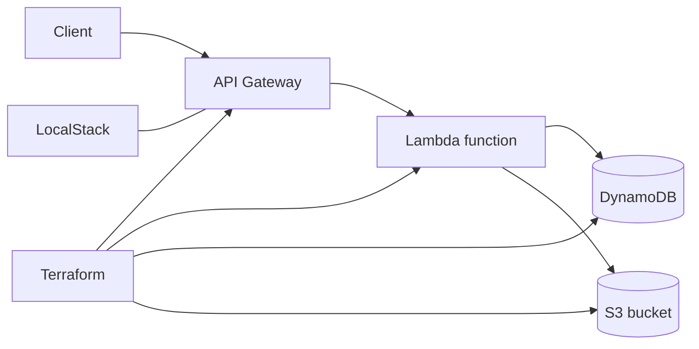

# AWS Serverless Infrastructure Lab

A local, reproducible infrastructure-as-code project that provisions a small serverless AWS architecture with Terraform and LocalStack. It demonstrates API integration, event-driven processing, storage, and infrastructure testing without requiring a paid cloud environment.

> Portfolio note: this repository began as a technical exercise. The implementation runs against LocalStack; production AWS deployment would require additional security, state, and operational controls.

## What this project demonstrates

- Terraform modules for AWS-style services
- Local cloud development with Docker Compose and LocalStack
- API Gateway integration with Lambda
- DynamoDB and S3 provisioning
- Repeatable infrastructure initialization and validation
- Practical debugging of service endpoints, dependencies, and deployment order

## Architecture



## Repository layout

| Path | Purpose |
| --- | --- |
| `docker-compose.yml` | LocalStack development environment |
| `terraform/` | Providers, variables, resources, modules, and outputs |
| `localstack/` | Local service initialization |
| `tfrunner/` | Terraform execution helper |

## Prerequisites

- Docker with Docker Compose
- Terraform
- AWS CLI
- curl or another HTTP client

## Quick start

Start the local AWS-compatible environment:

```bash
docker compose up -d
docker compose ps
```

Initialize and inspect the infrastructure:

```bash
cd terraform
terraform init
terraform fmt -check
terraform validate
terraform plan
terraform apply
```

Use the Terraform outputs to test the API endpoint, then inspect the Lambda, DynamoDB, and S3 resources through LocalStack. When finished:

```bash
terraform destroy
cd ..
docker compose down
```

## Validation checklist

- `docker compose ps` shows LocalStack healthy
- `terraform fmt -check` passes
- `terraform validate` passes
- `terraform plan` contains only expected changes
- API requests return the expected response
- DynamoDB and S3 resources are created in LocalStack
- Reapplying the configuration is idempotent

## Design decisions

- **LocalStack for fast feedback:** the project is testable without cloud cost or shared credentials.
- **Terraform for repeatability:** infrastructure changes are versioned, reviewable, and reproducible.
- **Modular resource layout:** service definitions are easier to reason about and extend.
- **Explicit outputs:** endpoints and resource identifiers are available for smoke tests and automation.

## Production hardening

For production AWS use, I would add a remote encrypted state backend with locking, least-privilege IAM, Secrets Manager or Parameter Store, Lambda logging and alarms, tracing, API authorization and throttling, encryption controls, CI policy and security scanning, environment separation, backups, and rollback/runbook documentation.

## Skills demonstrated

AWS · Terraform · LocalStack · Docker Compose · API Gateway · Lambda · DynamoDB · S3 · Infrastructure as Code
